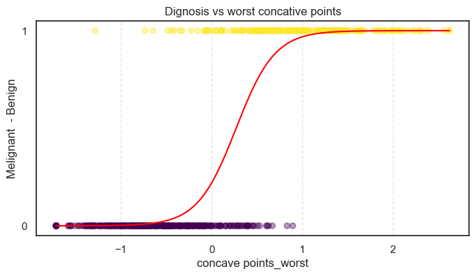
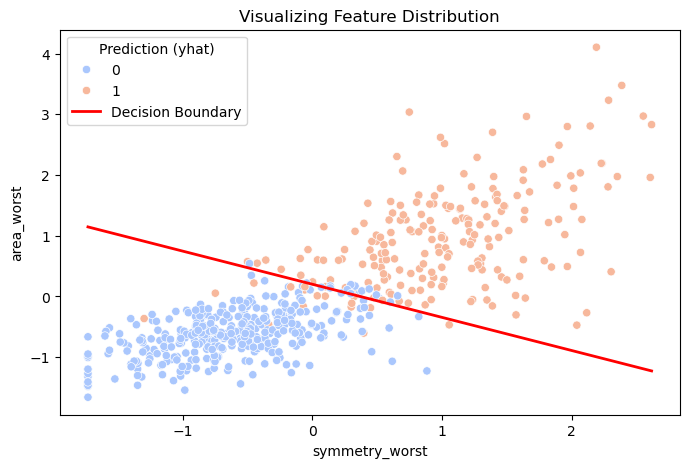

# Binary Classification from Scratch

The goal of this project is to demystify Logistic Regression. While Linear Regression predicts continuous values, this project focuses on predicting probabilities and making discrete classifications. I implemented the binary classification model using the Sigmoid function and Binary Cross-Entropy loss.

### Mathematical Implementation

I implemented the following components to move from linear output to probability.

The Sigmoid Function - to map any real-valued number into a range between 0 and 1:$$g(z) = \frac{1}{1 + e^{-z}}$$where $z = \mathbf{w} \cdot \mathbf{x} + b$.

#### Cost Function:

Log Loss - instead of MSE, I used Binary Cross-Entropy (Log Loss) with $L_2$ Regularization to penalize wrong classifications more heavily:$$J(\mathbf{w},b) = -\frac{1}{m} \sum_{i=0}^{m-1} \left[ y^{(i)} \log(f_{\mathbf{w},b}(\mathbf{x}^{(i)})) + (1 - y^{(i)}) \log(1 - f_{\mathbf{w},b}(\mathbf{x}^{(i)})) \right] + \frac{\lambda}{2m} \sum_{j=0}^{n-1} w_j^2$$

#### Optimization

The update rules for Gradient Descent look similar to Linear Regression, but the prediction $$f_{\mathbf{w},b}(\mathbf{x})$$now refers to the Sigmoid function:
$$\frac{\partial J(\mathbf{w},b)}{\partial w_j} = \frac{1}{m} \sum_{i=0}^{m-1} (f_{\mathbf{w},b}(\mathbf{x}^{(i)}) - y^{(i)})x_j^{(i)} + \frac{\lambda}{m}w_j$$

### Project Structure

├── Linear_Regression/

│ ├── data

│ ├── main_plots/

│ ├──linear_regression_from_scratch.ipynb

| ├──lr_with_multiple_variables.ipynb

│ └── requirements.txt

#### Evaluation Metrics

Since $R^2$ is for regression, I used accuracy - percentage of correct predictions.

### Visualising & Results

The notebook include visualization of data, visualization of splitting and visualisation of boundary made by model. There are two main
visualization: function buld on the data of 1 feature and second one with two features.

Result: The first model build using one feature achieved an accuracy of 0.88 on the breast_cancer dataset using just 1 feature to predict the type of the tumor based on the worst concave points.

The second model that used the worst symmetry and worst area to predict the type of tumor and reached 0.94 accuracy.
